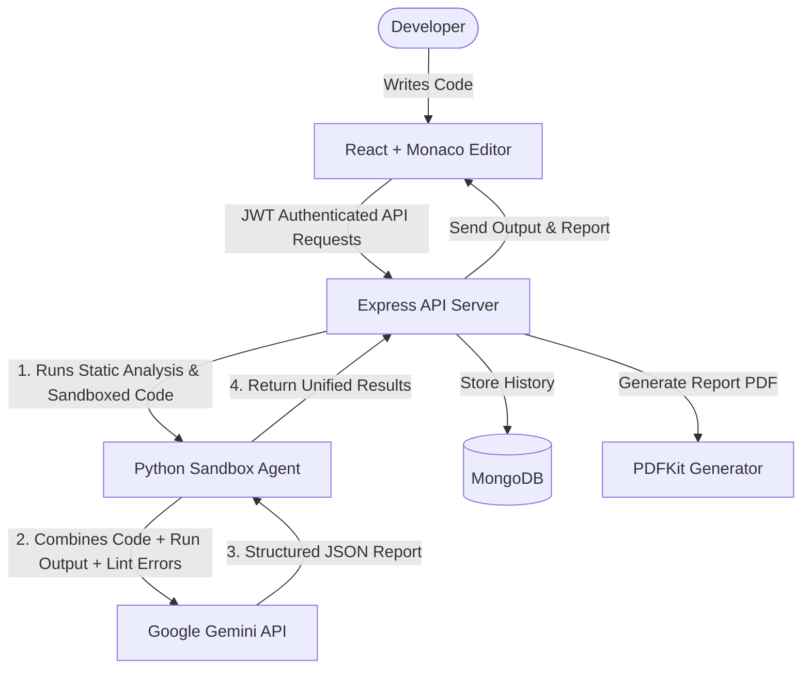

# 🚀 DevDebug Agent

[](#tech-stack)
[](#features)
[](#license)

**DevDebug Agent** is a full-stack, AI-powered developer platform designed to analyze, debug, execute, and translate code across multiple programming languages. By combining **static linting**, a **secure local execution sandbox**, and the reasoning capabilities of **Google Gemini models**, DevDebug Agent automatically identifies bugs, scans for security vulnerabilities, proposes optimized solutions, and generates beautifully styled PDF reviews.

---

## 🛠️ Architecture & Workflow

The platform coordinates a three-tier architecture:
1. **Frontend Dashboard**: A React single-page application featuring a Monaco Code Editor, interactive terminal, and real-time visualization of linting/AI reports.
2. **Express API Server**: Manages user authentication, saves persistent review histories in MongoDB, streams generated PDF reports, and spawns the core Python agent.
3. **Execution Sandbox & Python Agent**: A zero-dependency analyzer that runs syntax verification, executes code locally in a secure temp directory with automated timeouts, and queries the Gemini API with standard system reasoning prompts.



---

## ✨ Features

*   **🔍 AST & Static Linting**: Automatically parses Python syntax using Abstract Syntax Trees (AST), scans JavaScript for bad practices (like `eval()`), and flags unsafe C/C++ memory functions (like `gets()` or `strcpy()`).
*   **⚡ Secure Local Sandbox**: Safely runs code (Python, JavaScript, Java, C, C++) locally inside a dynamic directory with execution timeouts (5-second hard limit) to prevent runaway infinite loops or resource starvation.
*   **🤖 Gemini AI Diagnostics**: Leverages Gemini's reasoning capabilities to identify logical errors, assess performance complexity (Time/Space), scan for OWASP top-10 security flaws, and deliver a clean, drop-in replacement codebase.
*   **🌍 Multi-Language Code Translator**: Effortlessly translate code from one language to another (e.g., Python to C++ or Java to JavaScript) using specialized JSON schema prompts for translation fidelity.
*   **📄 High-Fidelity PDF Generation**: Compile any review session into a premium, styled PDF document directly from the server, featuring structured summaries, bug severity indicators, remediation guides, and formatting templates.
*   **🔒 Auth & Persistent History**: JWT-based session security with bcrypt passwords. Users can access, delete, or review their history of past code evaluations at any time.

---

## 💻 Tech Stack

### Frontend
*   **React 19 & Vite** (Single-page app framework)
*   **Monaco Editor** (Rich code editor with syntax highlighting)
*   **Lucide React** (Clean SVG icon system)
*   **Vanilla CSS** (Harmony dark mode layout, glassmorphism UI)

### Backend
*   **Node.js & Express** (Server framework)
*   **MongoDB & Mongoose** (Persistent database for reports and user auth)
*   **PDFKit** (Server-side PDF generation)
*   **JWT & BcryptJS** (Secure sessions & passwords)

### Core Analysis Agent
*   **Python 3** (Zero-dependency core runner using standard libraries: `ast`, `subprocess`, `urllib`, `shutil`)
*   **Gemini API** (Gemini 2.5 / 3.5 structured JSON responses)

---

## 🚀 Getting Started

### Prerequisites
Make sure you have the following installed on your local environment:
*   [Node.js](https://nodejs.org/) (v18 or higher)
*   [Python 3.x](https://www.python.org/)
*   [MongoDB](https://www.mongodb.com/try/download/community) (running locally or via MongoDB Atlas connection string)
*   *(Optional)* `g++` (for compiling/running C++ code) and `javac` (for compiling/running Java code) in your PATH.

### Installation

1. Clone this repository to your local machine:
   ```bash
   git clone https://github.com/your-username/devdebug-agent.git
   cd devdebug-agent
   ```

2. Install dependencies across all modules (root, backend, and frontend) using the root script shortcut:
   ```bash
   npm run install:all
   ```

### Configuration

Create a `.env` file in the **`backend`** directory:

```env
PORT=5000
MONGO_URI=mongodb://127.0.0.1:27017/devdebug
JWT_SECRET=your_super_secret_jwt_key
GEMINI_API_KEY=YOUR_GEMINI_API_KEY_HERE
NODE_ENV=development
```

> 💡 **Gemini API Key**: You can obtain a free API key from the [Google AI Studio](https://aistudio.google.com/).

### Running the Application

You can spin up both the backend API and frontend dev server concurrently using the single root script:

```bash
npm run dev
```

*   **Frontend**: Opens at [http://localhost:5173/](http://localhost:5173/)
*   **Backend API**: Running at [http://localhost:5000/](http://localhost:5000/)

---

## 📂 Project Directory Structure

```
devdebug-agent-root/
├── package.json          # Root scripts & dependencies (concurrently)
├── agent/                # Python core agent
│   ├── analyze.py        # Static parsing, local execution sandbox, & Gemini query agent
│   └── requirements.txt  # Core dependencies notes (zero external packages required)
├── backend/              # Node.js Express Backend
│   ├── db.js             # MongoDB connection config
│   ├── authRoutes.js     # User registration and sign-in routes
│   ├── authMiddleware.js # JWT verification middleware
│   ├── models.js         # Mongoose User and Report schemas
│   ├── routes.js         # API endpoints (analysis, translation, PDF generation)
│   ├── server.js         # Main server entrypoint
│   └── .env              # Backend environment configuration
├── frontend/             # React SPA Frontend
│   ├── src/
│   │   ├── main.jsx      # Vite app entrypoint
│   │   ├── App.jsx       # Main application layout, editor, history, and dashboard
│   │   ├── App.css       # Core styles
│   │   └── index.css     # Global custom CSS design tokens
│   ├── index.html
│   └── vite.config.js    # Vite configurations
└── samples/              # Test code files for Python, JS, C++ verification
```

---

## 🧪 Running Sandbox Verification Tests

To verify that the local execution sandbox, compiler integrations, and syntax checkers are functioning correctly on your machine, run the built-in test suite:

```bash
python test_sandbox.py
```

---

## 📄 License

This project is licensed under the MIT License - see the LICENSE file for details.
